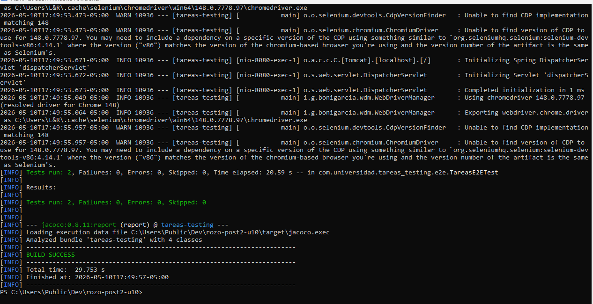
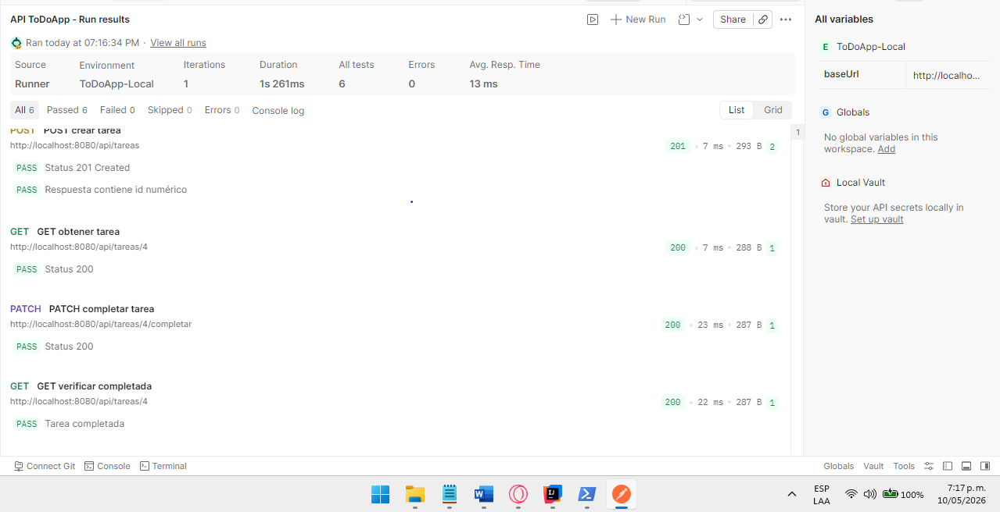
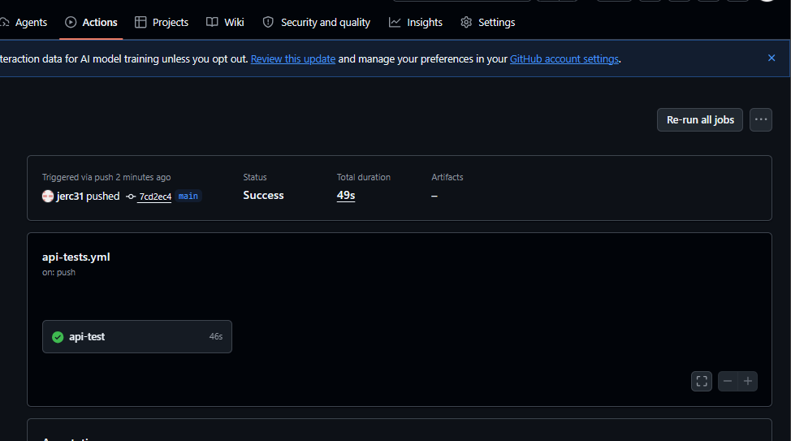

# Programación Web - Unidad 10

## Post-Contenido 2 - Pruebas E2E con Selenium, Postman y Newman

## Autor

- Nombre: Kevin Javier Ramirez
- Programa: Ingeniería de Sistemas
- Asignatura: Programación Web
- Unidad: 10 - Pruebas de Software en Aplicaciones Web
- Actividad: Post-Contenido 2
- Fecha: 2026

---

## Objetivo

Este proyecto implementa pruebas de extremo a extremo (E2E) sobre una aplicación
Spring Boot de gestión de tareas aplicando Selenium WebDriver con el patrón
Page Object Model, pruebas de API REST en Postman y automatización de ejecución
mediante Newman integrado con GitHub Actions.

---

## Tecnologías

- Java 17
- Spring Boot 3.2.x
- Maven 3.9.x
- Selenium WebDriver 4.18.1
- WebDriverManager 5.8.0
- JUnit 5
- Postman
- Newman
- GitHub Actions
- Google Chrome
- H2 Database

---

## Arquitectura implementada

```text
src/
├── main/
│   └── java/com/empresa/todo/
│       ├── controller/
│       ├── service/
│       ├── repository/
│       └── entity/
│
└── test/
    └── java/com/empresa/todo/
        └── e2e/
            ├── TareasPage.java
            ├── NuevaTareaPage.java
            └── TareasE2ETest.java

postman/
├── ColeccionToDo.json
├── env-local.json
└── env-ci.json

.github/
└── workflows/
    └── api-tests.yml
```

---

## Componentes implementados

### Selenium WebDriver

- Implementación de pruebas E2E usando Selenium.
- Uso del patrón Page Object Model.
- Encapsulamiento de selectores con constantes `By`.
- Ejecución en modo headless con Google Chrome.

### Postman

- Colección "API ToDoApp" con 5 requests.
- Variables dinámicas usando `pm.collectionVariables`.
- Test scripts para validar:
  - status code
  - body response
  - tiempos de respuesta
  - almacenamiento de IDs

### Newman

- Ejecución automatizada de la colección Postman.
- Integración en GitHub Actions.
- Pipeline automático en push y pull_request.

---

## Dependencias Maven

Agregar en `pom.xml`:

```xml
<dependency>
    <groupId>org.seleniumhq.selenium</groupId>
    <artifactId>selenium-java</artifactId>
    <version>4.18.1</version>
    <scope>test</scope>
</dependency>

<dependency>
    <groupId>io.github.bonigarcia</groupId>
    <artifactId>webdrivermanager</artifactId>
    <version>5.8.0</version>
    <scope>test</scope>
</dependency>
```

---

## Estructura E2E con Page Object Model

```text
TareasPage
│
├── btnNueva
├── listItems
├── contarTareas()
└── irANuevaTarea()

NuevaTareaPage
│
├── txtTitulo
├── txtDescripcion
├── btnGuardar
└── crearTarea()
```

---

## Configuración de Newman

Instalar Newman globalmente:

```powershell
npm install -g newman
```

Verificar instalación:

```powershell
newman -v
```

---

## Ejecución del Proyecto

### 1. Compilar aplicación

```powershell
.\mvnw.cmd clean compile
```

### 2. Ejecutar aplicación

```powershell
.\mvnw.cmd spring-boot:run
```

La aplicación queda disponible en:

```text
http://localhost:8080
```

---

## Ejecución de pruebas Selenium

```powershell
.\mvnw.cmd test
```

Pruebas implementadas:

- `paginaTareas_cargaCorrectamente`
- `crearTarea_desdeFormulario_funcionaCorrectamente`

---

## Ejecución de colección Postman

### En Postman Runner

1. Abrir colección `API ToDoApp`
2. Seleccionar entorno `ToDoApp-Local`
3. Ejecutar Runner
4. Verificar `0 failures`

---

## Ejecución con Newman

```powershell
newman run postman/ColeccionToDo.json `
  --environment postman/env-local.json
```

---

## Workflow GitHub Actions

Archivo:

```text
.github/workflows/api-tests.yml
```

Pipeline implementado:

```text
┌───────────────────────────┐
│ Push / Pull Request       │
└────────────┬──────────────┘
             │
             ▼
┌───────────────────────────┐
│ Checkout del repositorio  │
└────────────┬──────────────┘
             │
             ▼
┌───────────────────────────┐
│ Configuración Java 17     │
└────────────┬──────────────┘
             │
             ▼
┌───────────────────────────┐
│ Compilar aplicación       │
└────────────┬──────────────┘
             │
             ▼
┌───────────────────────────┐
│ Ejecutar aplicación       │
└────────────┬──────────────┘
             │
             ▼
┌───────────────────────────┐
│ Verificar health check    │
└────────────┬──────────────┘
             │
             ▼
┌───────────────────────────┐
│ Instalar Newman           │
└────────────┬──────────────┘
             │
             ▼
┌───────────────────────────┐
│ Ejecutar colección API    │
└───────────────────────────┘
```

---

## Colección Postman

### Requests implementados

| Método | Endpoint | Descripción |
| --- | --- | --- |
| POST | `/api/tareas` | Crear tarea |
| GET | `/api/tareas/{id}` | Obtener tarea |
| PATCH | `/api/tareas/{id}/completar` | Completar tarea |
| GET | `/api/tareas/{id}` | Verificar tarea completada |
| GET | `/api/tareas/999` | Validar error 404 |

---

## Test Scripts Postman

### Validación status 201

```javascript
pm.test("Status 201 Created", () => {
    pm.response.to.have.status(201);
});
```

### Guardar ID generado

```javascript
pm.test("Respuesta contiene id numérico", () => {
    const b = pm.response.json();

    pm.expect(b).to.have.property("id");

    pm.collectionVariables.set("tareaId", b.id);
});
```

### Tiempo de respuesta

```javascript
pm.test("Tiempo de respuesta < 500ms", () => {
    pm.expect(pm.response.responseTime).to.be.below(500);
});
```

---

## Checkpoints y Evidencias

### Checkpoint 1 — Selenium y Page Object Model

Se implementaron:

- `TareasPage`
- `NuevaTareaPage`
- Tests E2E con Selenium
- Ejecución headless con ChromeDriver

Comprobación:

```powershell
.\mvnw.cmd test
```

Evidencia:

```text
evidencias/selenium_tests_verde.png
```

---

### Checkpoint 2 — Colección Postman

Se implementó:

- Colección `API ToDoApp`
- Entorno local y CI
- 5 requests encadenados
- Variables dinámicas
- Scripts de validación

Comprobación:

```powershell
newman run postman/ColeccionToDo.json `
  --environment postman/env-local.json
```

Evidencia:

```text
evidencias/postman_runner_0_failures.png
```

---

### Checkpoint 3 — GitHub Actions + Newman

Se implementó:

- Workflow `api-tests.yml`
- Ejecución automática CI
- Integración con Newman

Comprobación:

1. Realizar push al repositorio
2. Abrir pestaña Actions
3. Verificar workflow en verde

Evidencia:

```text
evidencias/github_actions_newman.png
```

---

## Evidencias del Proyecto

### Selenium tests en verde

```markdown

```

### Postman Runner sin errores

```markdown

```

### Workflow GitHub Actions passing

```markdown

```

---

## Estructura del Repositorio

```text
apellido-post2-u10/
│
├── postman/
│   ├── ColeccionToDo.json
│   ├── env-local.json
│   └── env-ci.json
│
├── .github/
│   └── workflows/
│       └── api-tests.yml
│
├── src/
├── evidencias/
├── pom.xml
└── README.md
```

---

## Repositorio GitHub

```text
https://github.com/kevinjavierramirez55-tech/ramirez-post2-u10
```

---

## Buenas prácticas aplicadas

- Uso de Page Object Model.
- Encapsulamiento de selectores Selenium.
- Automatización CI con GitHub Actions.
- Validaciones automáticas en Postman.
- Ejecución de pruebas automatizadas con Newman.
- Organización del proyecto por capas y carpetas.
- Commits descriptivos siguiendo convenciones Git.

---

## Comandos útiles

### Ejecutar tests

```powershell
.\mvnw.cmd test
```

### Ejecutar aplicación

```powershell
.\mvnw.cmd spring-boot:run
```

### Ejecutar Newman

```powershell
newman run postman/ColeccionToDo.json `
  --environment postman/env-local.json
```

### Ejecutar workflow localmente

```powershell
mvn clean package
java -jar target/*.jar
```

## Capturas del Proyecto

Las siguientes capturas se encuentran en la carpeta `/evidencias/`:

# Test E2E pasados



## 5 test pasados con postman



## Test comprobado en Actions del repositorio


